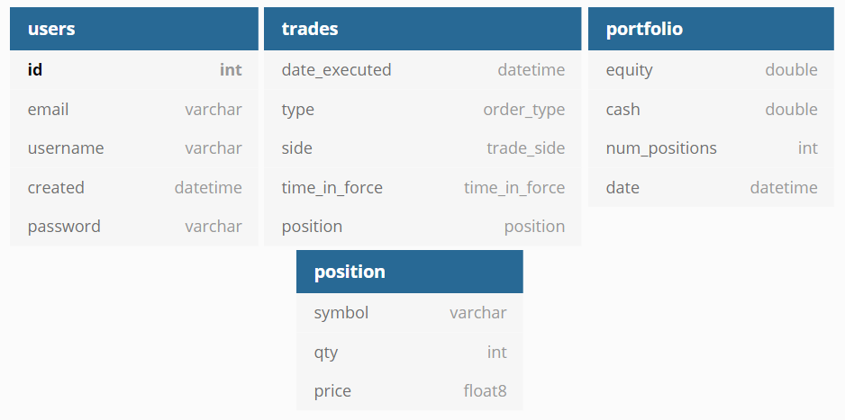
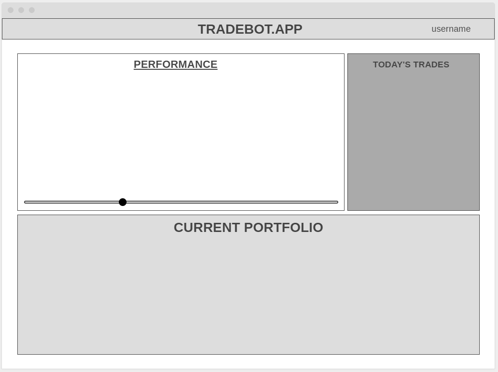

# Trade Bot Website

**If you are reading this, please note: this project is currently under development. While this is a public repo, sensative parts of this project that house financial information and likeness are excluded temorarily.**

This application will be live on **https://tradebot.app/** and will house a demo for the full-stack development effort that will showcase the Python-based trade bot. Using **Python/Django** and **Bootstrap** (potentially **React** later stages), I will implemenent a dynamic, user-based environment to track project developments.

This is developed using a virtual environment.

Key Features:

* Fill this in later.

# Schema

# Homepage

